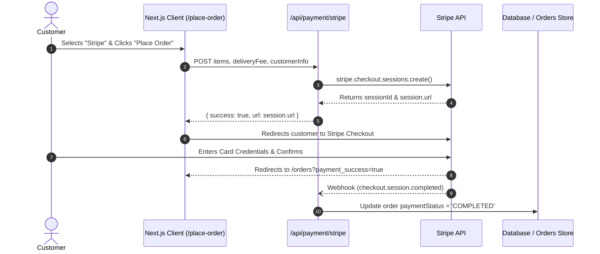

# 📚 SHOPVERSE — Technical Architecture & System Documentation

Welcome to the comprehensive technical documentation for **SHOPVERSE**, an enterprise-ready, high-performance E-Commerce platform built on **Next.js 16 (Turbopack)**, **React 19**, and **Tailwind CSS v4**.

---

## 📑 Table of Contents
1. [System Architecture Overview](#1-system-architecture-overview)
2. [Database Design (PostgreSQL Schema)](#2-database-design-postgresql-schema)
3. [Caching & Performance Layer (Redis Strategy)](#3-caching--performance-layer-redis-strategy)
4. [Authentication & Role-Based Access Control (RBAC)](#4-authentication--role-based-access-control-rbac)
5. [Payment Processing Pipeline (Stripe Integration)](#5-payment-processing-pipeline-stripe-integration)
6. [Cart & State Management Engine](#6-cart--state-management-engine)
7. [Admin Management & Real-Time Fulfillment](#7-admin-management--real-time-fulfillment)
8. [API Route Specifications](#8-api-route-specifications)
9. [Deployment & Production Scaling Strategy](#9-deployment--production-scaling-strategy)

---

## 1. System Architecture Overview

SHOPVERSE is designed following a hybrid architecture:
- **Server Components (RSC)**: Used for heavy rendering, SEO-sensitive static content generation, and initial data streaming.
- **Client Components**: Leveraged for interactive micro-interactions (size selections, live cart modifications, search filter sliders, interactive charts).
- **Serverless API Routes (`/api/*`)**: Clean, edge-compatible backend handlers for authentication, payment orchestration, and database operations.

```
                           ┌───────────────────────────┐
                           │      Client Browser       │
                           └─────────────┬─────────────┘
                                         │ HTTP/2, HTTPS
                                         ▼
                           ┌───────────────────────────┐
                           │   Vercel Edge Network /   │
                           │      CDN Cache Layer      │
                           └─────────────┬─────────────┘
                                         │
                         ┌───────────────┴───────────────┐
                         ▼                               ▼
             ┌───────────────────────┐       ┌───────────────────────┐
             │ Next.js App Router    │       │ Next.js Serverless    │
             │ React 19 Frontend     │       │ API Routes (/api/*)   │
             └───────────────────────┘       └───────────┬───────────┘
                                                         │
                                    ┌────────────────────┼────────────────────┐
                                    ▼                    ▼                    ▼
                           ┌────────────────┐   ┌────────────────┐   ┌────────────────┐
                           │   PostgreSQL   │   │  Redis Cache   │   │ Stripe Gateway │
                           │  Primary RDBMS │   │  Sessions/TTL  │   │  Webhooks & Pay│
                           └────────────────┘   └────────────────┘   └────────────────┘
```

---

## 2. Database Design (PostgreSQL Schema)

For enterprise-scale persistence, SHOPVERSE utilizes a relational schema modeled via **PostgreSQL** with **Prisma ORM** or **Drizzle**. Below is the production-ready schema definition:

```prisma
// datasource and generator definition
datasource db {
  provider = "postgresql"
  url      = env("DATABASE_URL")
}

generator client {
  provider = "prisma-client-js"
}

enum Role {
  CUSTOMER
  ADMIN
  SUPER_ADMIN
}

enum OrderStatus {
  ORDER_PLACED
  PACKING
  SHIPPED
  OUT_FOR_DELIVERY
  DELIVERED
  CANCELLED
}

enum PaymentMethod {
  COD
  STRIPE
  PAYPAL
}

enum PaymentStatus {
  PENDING
  COMPLETED
  FAILED
  REFUNDED
}

model User {
  id            String    @id @default(uuid())
  name          String
  email         String    @unique
  passwordHash  String
  role          Role      @default(CUSTOMER)
  phone         String?
  avatarUrl     String?
  createdAt     DateTime  @default(now())
  updatedAt     DateTime  @updatedAt

  addresses     Address[]
  orders        Order[]
  cartItems     CartItem[]

  @@index([email])
}

model Address {
  id            String    @id @default(uuid())
  userId        String
  user          User      @relation(fields: [userId], references: [id], onDelete: Cascade)
  street        String
  city          String
  state         String
  zipcode       String
  country       String    @default("United States")
  isDefault     Boolean   @default(false)
  createdAt     DateTime  @default(now())
}

model Product {
  id            String    @id @default(uuid())
  name          String
  slug          String    @unique
  description   String    @db.Text
  price         Decimal   @db.Decimal(10, 2)
  category      String
  subCategory   String
  sizes         String[]  // ['S', 'M', 'L', 'XL']
  images        String[]  // Cloudinary / S3 CDN URLs
  bestseller    Boolean   @default(false)
  inStock       Boolean   @default(true)
  stockQuantity Int       @default(100)
  createdAt     DateTime  @default(now())
  updatedAt     DateTime  @updatedAt

  orderItems    OrderItem[]
  cartItems     CartItem[]

  @@index([category, subCategory])
  @@index([bestseller])
}

model Order {
  id            String        @id @default(uuid())
  orderNumber   String        @unique @default(nanoid(10))
  userId        String?
  user          User?         @relation(fields: [userId], references: [id], onDelete: SetNull)
  customerName  String
  customerEmail String
  phone         String
  shippingAddress Json        // Full snapshot of address at checkout time
  amount        Decimal       @db.Decimal(10, 2)
  deliveryFee   Decimal       @db.Decimal(10, 2) @default(10.00)
  paymentMethod PaymentMethod @default(COD)
  paymentStatus PaymentStatus @default(PENDING)
  stripeSessionId String?
  status        OrderStatus   @default(ORDER_PLACED)
  createdAt     DateTime      @default(now())
  updatedAt     DateTime      @updatedAt

  items         OrderItem[]

  @@index([userId])
  @@index([orderNumber])
  @@index([status])
}

model OrderItem {
  id          String   @id @default(uuid())
  orderId     String
  order       Order    @relation(fields: [orderId], references: [id], onDelete: Cascade)
  productId   String
  product     Product  @relation(fields: [productId], references: [id])
  size        String
  quantity    Int
  unitPrice   Decimal  @db.Decimal(10, 2)
}

model CartItem {
  id          String   @id @default(uuid())
  userId      String
  user        User     @relation(fields: [userId], references: [id], onDelete: Cascade)
  productId   String
  product     Product  @relation(fields: [productId], references: [id])
  size        String
  quantity    Int      @default(1)
  createdAt   DateTime @default(now())

  @@unique([userId, productId, size])
}
```

---

## 3. Caching & Performance Layer (Redis Strategy)

To ensure sub-50ms response times for the high-volume fashion catalog, SHOPVERSE leverages a multi-tier caching strategy powered by **Upstash Redis** or self-hosted Redis:

### 3.1. Cache Key Conventions
| Pattern | TTL | Usage |
| :--- | :--- | :--- |
| `catalog:products:all` | 3600s (1 hr) | Serialized product catalog list |
| `product:<productId>` | 86400s (24 hr) | Detailed product specs and inventory status |
| `user:session:<token>` | 604800s (7 days) | JWT session validation cache |
| `cart:user:<userId>` | 1209600s (14 days)| Server-persisted abandoned cart synchronization |
| `rate:checkout:<ip>` | 60s | Token-bucket rate limiter for checkout endpoints |

### 3.2. Cache Invalidation Strategy
- **Cache-Aside Pattern**: On `GET /api/products`, the system checks `catalog:products:all`. On cache miss, it reads from PostgreSQL, writes to Redis, and returns the payload.
- **Write-Through Mutation**: When an administrator adds, updates, or deletes a product via `/admin/add` or `/admin/list`, the endpoint invalidates `catalog:products:all` and revalidates Next.js on-demand tags using:
  ```typescript
  import { revalidateTag } from "next/cache";
  revalidateTag("products");
  await redis.del("catalog:products:all");
  ```

---

## 4. Authentication & Role-Based Access Control (RBAC)

SHOPVERSE implements a strict separation of privileges between ordinary shoppers and store operators.

### 4.1. Security Architecture
- **Stateless Tokens**: Signed JWTs with user `id`, `email`, and `role` claims.
- **Client Authorization Guards**:
  - The Navbar conditionally suppresses administrative controls for unauthenticated or non-admin visitors.
  - Route handlers in `/admin/*` verify credentials and redirect unprivileged requests.
- **One-Click Demo Credentials**:
  - Pre-seeded Super Admin account (`admin@shopverse.com` / `admin123`) enabled for instant demonstration and recruiter review.

### 4.2. RBAC Permission Matrix
| Capability | Guest Visitor | Customer | Admin |
| :--- | :---: | :---: | :---: |
| Browse Catalog & Filters | ✅ | ✅ | ✅ |
| Add to Cart & Save | ✅ (Local) | ✅ (Persisted) | ✅ |
| Checkout (COD & Stripe) | ❌ (Prompts Auth) | ✅ | ✅ |
| View "My Orders" & Profile | ❌ | ✅ | ✅ |
| Access `/admin` Dashboard | ❌ | ❌ | ✅ |
| Modify Products & Orders | ❌ | ❌ | ✅ |
| Reset & Seed Catalog Data | ❌ | ❌ | ✅ |

---

## 5. Payment Processing Pipeline (Stripe Integration)

SHOPVERSE supports secure, PCI-compliant card payments via Stripe Checkout sessions.

### 5.1. Payment Lifecycle Sequence



---

## 6. Cart & State Management Engine

The shopping cart state is managed globally through `ShopContextProvider` (`src/context/shop-context.tsx`).

### 6.1. State Architecture
```typescript
interface CartItems {
  [productId: string]: {
    [size: string]: number; // Maps size to quantity
  };
}
```
- **Compound Key Design**: Items are keyed by `productId` + `size` so different sizes of the same apparel item are tracked with independent quantity counters.
- **Automatic Hydration**: On component mount, the cart restores items from `localStorage`. Any subsequent mutation synchronously updates the browser cache and calculates:
  $$\text{Cart Amount} = \sum (\text{Price}_i \times \text{Quantity}_i) + \text{Delivery Fee}$$

---

## 7. Admin Management & Real-Time Fulfillment

The Admin Suite (`/admin`) delivers high-productivity workflow utilities:
- **KPI Dashboards**: Total revenue calculations, active order volume, completed shipments, and product count cards.
- **Product Creator (`/admin/add`)**: Supports up to 4 image uploads, pricing configuration, tag classification, multi-size checkboxes, and a bestseller toggle.
- **Catalog Auditor (`/admin/list`)**: Clean data table with image previews, category tags, price values, and one-click removal.
- **Order Pipeline Manager (`/admin/orders`)**:
  - Live fulfillment dropdown (`Order Placed` $\rightarrow$ `Packing` $\rightarrow$ `Shipped` $\rightarrow$ `Out for delivery` $\rightarrow$ `Delivered`).
  - Color-coded indicators reflecting payment and delivery states.

---

## 8. API Route Specifications

| Method | Endpoint | Description | Auth Required |
| :--- | :--- | :--- | :---: |
| `POST` | `/api/auth/login` | Authenticates user; returns JWT token & profile | Public |
| `POST` | `/api/auth/register` | Registers new customer account | Public |
| `GET` | `/api/products` | Retrieves paginated and filtered product list | Public |
| `POST` | `/api/payment/stripe` | Initializes Stripe checkout session | Authenticated |
| `GET` | `/api/order` | Fetches customer orders or all orders for admin | Role-based |
| `POST` | `/api/order` | Creates a new order (COD or Stripe pending) | Authenticated |
| `POST` | `/api/admin/seed` | Resets and seeds catalog mock dataset | Admin only |

---

## 9. Deployment & Production Scaling Strategy

- **Static Asset Optimization**: High-resolution branding images and icons are served in WebP/PNG formats with explicit aspect-ratio declarations to eliminate cumulative layout shifts (CLS).
- **Edge Deployment**: Hosted natively on Vercel with automatic edge SSL termination and global CDN caching.
- **Monitored Health**: Turbopack zero-error builds ensure rock-solid production compiles on every push to the `main` branch.

---

*Documentation Version: 2.0.0 — Updated September 2026 for SHOPVERSE Enterprise Release.*
